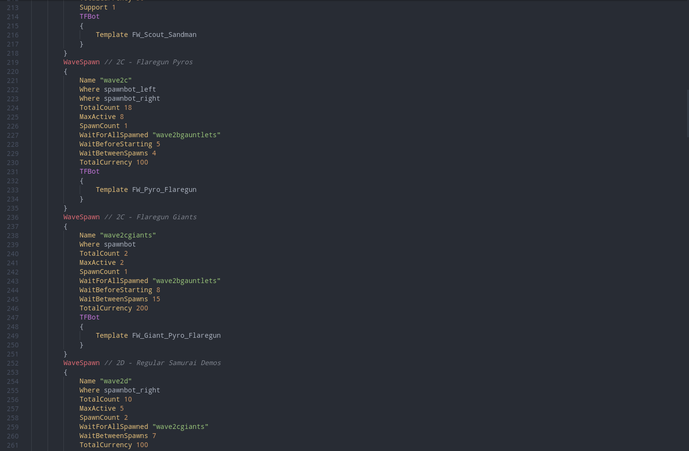

## Features

This extension adds basic syntax highlighting for the Valve popfile formatting to VSCode, and automatically associates .pop files with the syntax.

Here's what it might look like for a basic popfile:

## Release Notes

### 1.0.0

- Initial release
- Supports case-insensitive highlighting for all valid item and character attributes, as well as common popfile keywords (WaveSchedule, WaveSpawn, etc.)
